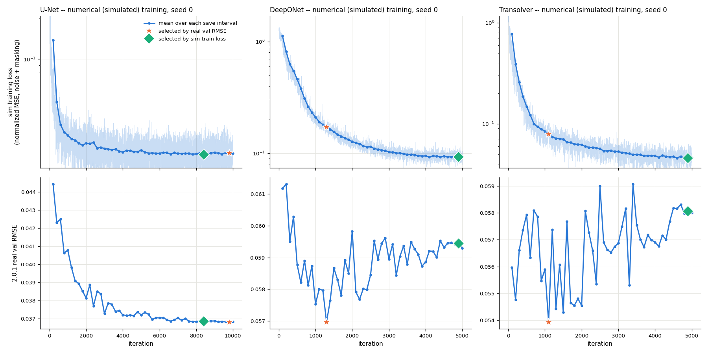

# 補充實驗：Simulated training 的 checkpoint 選擇——模擬訓練 loss vs real val

- 日期：2026-10-04；決策紀錄：D-031
- 範圍：論文的三個 baseline（U-Net、DeepONet、Transolver），**numerical（simulated training）設定**，seed 0。不含 FM。
- 評估：2.0.1 real test，N_ar = 1；協議和 Phase 4 完全相同（`scripts/eval_ckpts.py` → `pilfm/official_eval.py`，指標來自官方 `eval_metrics`）。

## 1. 問題

官方流程（`train.py`）不論訓練資料是哪一種，都用 **real val RMSE** 選 checkpoint。但 simulated training 的前提是「只用模擬資料」：如果選點用到 real val，就已經用了 real 資料，嚴格來說不算 zero-shot。

這個實驗改用**模擬訓練 loss**（只看模擬資料）選 checkpoint，和官方的 real val 選點在同一個 test set 上比較。

## 2. 做法

**對象**：我們在 2.0.0 時期重訓的 numerical seed 0。Phase 4 決定不重訓 numerical（D-017），這三個 run 也就是 Phase 4 主表 numerical 列用的 run。它們每 num_update / 50 步存一個 checkpoint，共 50 個；官方 checkpoint 沒有中間點，無法做這個實驗。

| 模型 | run 目錄（`/work/b314513067/pi-lfm/runs/`） | 總步數 | 存檔間隔 |
|---|---|---|---|
| U-Net | `unet/unet_cylinder_numerical_False/2026-09-15_20-22-46` | 10000 | 200 |
| DeepONet | `deeponet/deeponet_cylinder_numerical_False/2026-09-15_20-21-44` | 5000 | 100 |
| Transolver | `transolver/transolver_cylinder_numerical_False/2026-09-15_20-22-46` | 5000 | 100 |

**模擬訓練 loss**：就是官方訓練迴圈裡的 loss（`train.py:339`），在正規化後的 numerical 資料上計算，包含官方的模擬加噪（0.1）和模態遮蔽，每步一個 batch。逐步的值存在每個 checkpoint 的 `train_losses` 裡，不需要重新計算。

**選點準則**：checkpoint i 的分數 = 結束於 i 的那一個存檔間隔內的平均訓練 loss，取最小者。單一步的 loss 只是一個 batch，雜訊太大，取區間平均剛好對應每個 checkpoint。

**敏感度檢查**：另外測兩個點：5 倍寬視窗選出的點、最後一個 checkpoint。

**對照組**：Phase 4 的 real val 選點，也就是在 2.0.1 real val 上 RMSE 最小的 checkpoint（Step 3.4），test 結果直接沿用 `results/v2.0.1/phase4_test/*_numerical_s0.json`。

## 3. 結果

完整指標：`results/v2.0.1/sim_trainloss_sel/summary.md`（CSV：`summary.csv`）。

| 模型 | 選點方式 | iteration | 模擬訓練 loss | real val RMSE | **test RMSE** | Rel L2 | R² | fRMSE | FE | KE | ΔRMSE |
|---|---|---|---|---|---|---|---|---|---|---|---|
| U-Net | real val（官方） | 9800 | 0.02018 | 0.03682 | **0.03711** | 0.2086 | 0.634 | 0.00564 | 112 | 2.63e-4 | – |
| U-Net | 模擬訓練 loss 最小 | 8400 | 0.01964 | 0.03685 | **0.03714** | 0.2088 | 0.634 | 0.00564 | 112 | 2.63e-4 | +0.08% |
| U-Net | 同上，5 倍視窗 | 8600 | 0.01988 | 0.03685 | 0.03713 | 0.2089 | 0.634 | 0.00564 | 113 | 2.63e-4 | +0.07% |
| U-Net | 最後一個 | 10000 | 0.02006 | 0.03683 | 0.03711 | 0.2087 | 0.634 | 0.00564 | 112 | 2.63e-4 | +0.01% |
| DeepONet | real val（官方） | 1300 | 0.17132 | 0.05696 | **0.05740** | 0.3206 | 0.125 | 0.00908 | 199 | 3.28e-4 | – |
| DeepONet | 模擬訓練 loss 最小 | 4900 | 0.09246 | 0.05944 | **0.05986** | 0.3319 | 0.048 | 0.00955 | 239 | 3.23e-4 | +4.29% |
| DeepONet | 同上，5 倍視窗 = 最後一個 | 5000 | 0.09317 | 0.05930 | 0.05973 | 0.3311 | 0.053 | 0.00953 | 235 | 3.24e-4 | +4.05% |
| Transolver | real val（官方） | 1100 | 0.07932 | 0.05394 | **0.05454** | 0.2993 | 0.210 | 0.00875 | 149 | 3.37e-4 | – |
| Transolver | 模擬訓練 loss 最小 | 4900 | 0.04580 | 0.05806 | **0.05864** | 0.3202 | 0.087 | 0.00939 | 310 | 3.43e-4 | +7.52% |
| Transolver | 同上，5 倍視窗 = 最後一個 | 5000 | 0.04596 | 0.05800 | 0.05858 | 0.3196 | 0.089 | 0.00938 | 309 | 3.43e-4 | +7.41% |
| persistence | – | – | – | – | 0.0364 | 0.1807 | 0.648 | 0.00450 | 47.6 | 3.58e-4 | – |

上排：模擬訓練 loss（淡線是逐步值，深線是每個存檔間隔的平均）；下排：2.0.1 real val RMSE。★ 是 real val 選的點，◆ 是模擬訓練 loss 選的點。圖檔：`results/v2.0.1/sim_trainloss_sel/curves.png`（repo 內快照：`docs/figures/phase4/sim_trainloss_selection.png`）。

## 4. 觀察

1. **三個模型的模擬訓練 loss 都一路下降到最後**，最小值都落在最後 1–2 個 checkpoint。所以「模擬訓練 loss 最小」實際上幾乎等於「訓練到底」。三種模擬 loss 選法（區間平均、5 倍視窗、最後一個）的 test 結果非常接近，結論不受選法細節影響。
2. **U-Net：兩種選法沒有差別**（+0.01% 到 +0.08%）。它的 real val 曲線在 6000 步之後也是平的，real val 選到的點本來就在末端。
3. **DeepONet 和 Transolver：用模擬 loss 選比較差**，test RMSE 分別高 4.1–4.3% 和 7.4–7.5%。R² 和 FE 也明顯變差：Transolver 的 FE 從 149 升到約 309，R² 從 0.21 掉到 0.09。這兩個模型的模擬 loss 持續下降，real val 卻在很早（1100–1300 步）就到最低，之後隨訓練變差。這就是 Step 3.4 看到的 early-peak：越擬合模擬資料，對 real 越不利。
4. **real val 選點的優勢應該看成上限，而不是 zero-shot 的真實表現**：
   - 它用了 real 資料，違反 simulated training「只用模擬資料」的前提。
   - Transolver 的 real val 曲線雜訊很大（0.054–0.059 之間跳動），real val 選點等於在雜訊中挑最低點。
   - Step 1.3 發現 val 和 test 共用全部 92 個 sim，在 T_in + T_out = 40 下約 75% 的時間窗重疊，所以 val 上挑到的低點很可能在 test 上也偏低。
   - 也就是說，Transolver 的 7.5% 差距裡，有一部分可能來自 val 和 test 的相關性，而不是真的選到了比較好的模型。
5. **對論文 Table 1 的意義**：論文的 cylinder 數字是在 2.0.0 上算的。2.0.0 的 `3656.h5` 那條軌跡主導了 RMSE（見 Phase 0–4 總報告 §0），所以 RMSE 不能直接比，只比 Rel L2：

| 模型 | 論文 Table 1（2.0.0） | 官方 checkpoint 在 2.0.1 | 我們的 real val 選點 | 我們的模擬 loss 選點 |
|---|---|---|---|---|
| U-Net | 0.2165 | 0.2102 | 0.2086 | 0.2088 |
| DeepONet | 0.3592 | 0.3563 | 0.3206 | 0.3319 |
| Transolver | 0.3224 | 0.3147 | 0.2993 | 0.3202 |

   官方 checkpoint 的程式碼是用 real val 選點，但當時用的是 2.0.0 的 val，而且我們不知道它選在哪一步，所以無法從這張表推斷論文用了哪種選法。這張表只說明：兩種選法的差距（DeepONet 0.011、Transolver 0.021）和「我們的復現與官方 checkpoint 的差距」是同一個數量級。

## 5. 結論與建議

- 用模擬訓練 loss 選點，對 U-Net 沒有影響，對 DeepONet、Transolver 會讓 zero-shot 結果變差 4–8%。
- **如果要嚴格遵守 zero-shot 的定義，應該用模擬資料選點**。目前 Phase 4 主表的 numerical 列用的是 real val 選點，屬於官方協議，但數字偏樂觀。報告或論文中引用 numerical 結果時，建議兩種都列，並註明選點方式。
- 一個更符合 zero-shot 的折衷是用**模擬資料的 val split** 選點，而不是訓練 loss。訓練 loss 只反映擬合程度，看不到過擬合。不過模擬資料本身和 real 有落差，所以即使用模擬 val，結果多半也和「訓練到底」差不多。這個沒有做，需要的話可以另外補。

## 6. 檔案

| 內容 | 路徑 |
|---|---|
| 選點腳本 | `scripts/select_by_train_loss.py`（code commit 26db28e） |
| 彙整與畫圖 | `scripts/summarize_sim_trainloss_sel.py` |
| 選點表 / job 清單 | `results/v2.0.1/sim_trainloss_sel/selection.csv`、`jobs.json` |
| 每個 checkpoint 的 test 結果（含 metadata） | `results/v2.0.1/sim_trainloss_sel/test/<model>_numerical_s0_it<iteration>.json` |
| 彙整表、圖 | `results/v2.0.1/sim_trainloss_sel/summary.{md,csv}`、`curves.png` |
| 對照組（real val 選點） | `results/v2.0.1/phase4_test/{unet,deeponet,transolver}_numerical_s0.json` |
| real val 曲線（Step 3.4） | `results/v2.0.1/val_curves/*_numerical_False__*.json` |

執行：slurm job 496328（1 張 H200，約 14 分鐘），dataset 2.0.1，官方 code commit 62f4c80。
